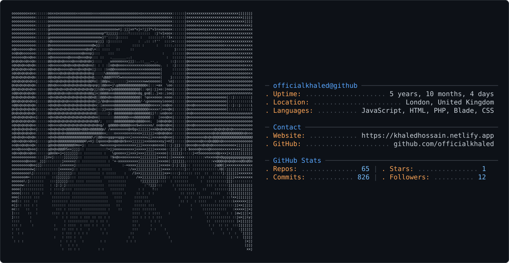

# Khaled Hossain
### Software Engineer

<!--  -->

<picture>
  <source media="(prefers-color-scheme: dark)" srcset="dark_mode.svg" />
  <source media="(prefers-color-scheme: light)" srcset="light_mode.svg" />
  
</picture>

## 📌 About Me
- 🔭 I’m currently improving my knowledge of DevOps & Cloud.
- 🌱 Enhancing my FastAPI & React.js mastery.
- ⚡ Looking for Internships and Graduate Role Opportunities

## 🧠 My Focus Areas
- Software Engineering
- DevOps

## 📊 GitHub Stats

  
  

## 🔗 Connect with Me

  

  

